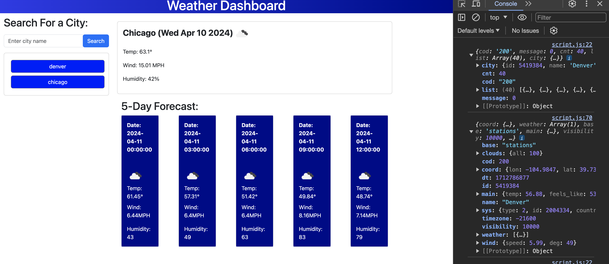
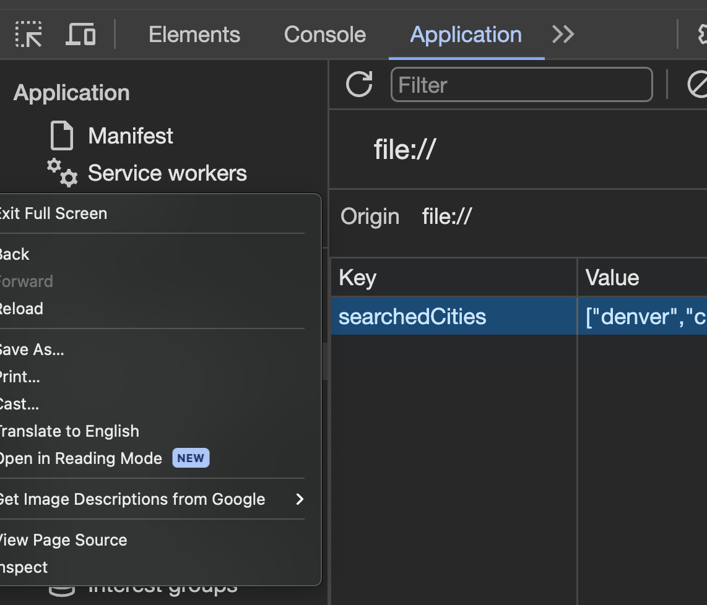

# weather-dashboard-hw-6
An app that displays a Weather dashboard to read about current and future weather patterns. The app displays the date, temp, wind speed, and humidity level. 

## No installation 

## Documentation 
Refer to the openweather API docs for information on using the API!

Current Weather API:
https://openweathermap.org/current

5 day forecast API:
https://openweathermap.org/forecast5

## Usage
1. To use the app simply go to the deployed app at the following link
(https://soko77788.github.io/weather-dashboard-hw-6/)

2. While on the app you'll see a search bar. Type in a city and the app will fetch the data from a weather api and display it momentarily on screen. 

3. If you right click -> Inspect -> Console you can get an idea of the information the API is logging to the console. Click

3. The top box displays current weather and the bottom 5 cards display the following 5 day forecast. 

4. When a city is searched a *NEW* button is generated in the saved search history. These buttons will load data from that city on click!

5. **To delete your search history right click -> Inspect -> Application (also Local Storage) -> and right click the *key* to clear or delete. Upon page refresh the search history will be gone.**

## No Contributions/License/Update history

## Credits

3rd party library Bootstrap

OpenWeather API

Student Learning Assistant AI

Chat GPT

Reference of youtuber Ranjan-Beginner's Guide
Watch him go through setting up 5-day forecast!
https://www.youtube.com/watch?v=QEu8_5bYm-w

## Lessons Learned

1. Some experience gained with using parameters and pulling data from a fetch request. 

2. displaying icons distributed from an api by constructing temperal literates

3. Ways to handle javascript time to display certain dates without actually using dayjs

4. More experience with bootstrap interface

## Obstacles Overcome

1. Getting an API key to work. Waiting hours not knowing if the call is wrong or if it's just not activated yet. 

2. Simply fetching data and getting what you want is not easy. In this apps case 2 different API calls. 

3. Using one calls data to be part of a 2nd calls parameters was ultra tricky. 

4. Making sure you have all your containers, classes, and id's set up nicely so when you try to displaying fetched data the app doesn't break. 
Example: When pulling data from the 5-day forecast and looping over it to display in 5 different cards took finding only *part* of an id and adding numbers to the end to hit the correct card. 

